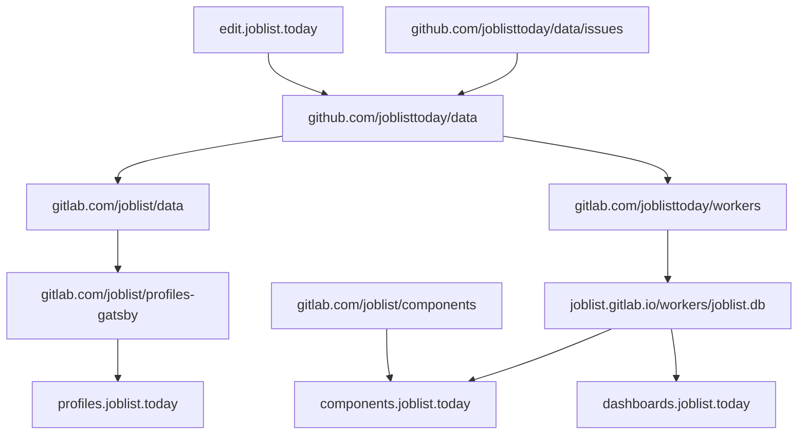

🌍 **joblist.today** is a [curated list of projects and companies hiring around the world](https://github.com/joblisttoday/data), and an open system to present, enrich and search that data.

- add a **new company**, with a github account, through the (headless) [cms](https://edit.joblist.today) or a github [issue](https://github.com/joblisttoday/data/issues/new/choose)
- search available jobs on https://joblist.today
- explore all companies https://profiles.joblist.today
- discover available job board providers https://providers.joblist.today
- try the job list api https://api.joblist.today
- community chat [#joblist.today:matrix.org](https://matrix.to/#/%23joblist.today%3Amatrix.org)
- [gitlab](https://gitlab.com/joblist) for the rest of the project's code and data

It is all libre software and crowdsourced open data, feel free to comment and contribute.

The objectives are to offer a transparent resource for job-seekers and company cultures.

# Data flow

